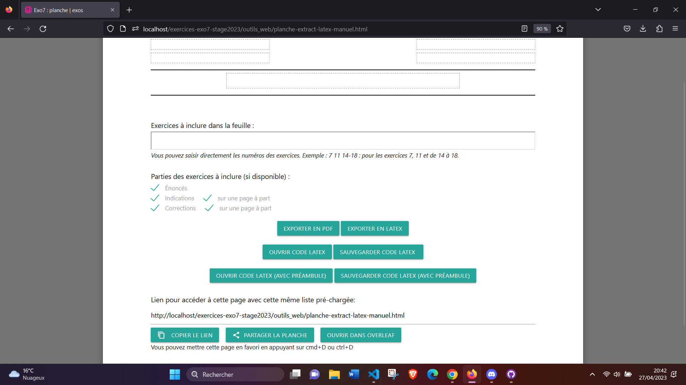

# Journal

## Date (chronologique inverse)

remarques etc.

Possibilité de mettre des screenshots : la syntaxe est :


Si vous avez juste un peu de code à mettre, n'utilsez pas de screenshots, écrivez le code au format texte, comme ceci :

```javascript
const myArray = [];
```

On peut aussi inliner du `code` dans un paragraphe.

Et on peut mettre des liens cliquables, par exemple
[Syntaxe basique en markdown](https://www.markdownguide.org/basic-syntax/)

## 31 mai - 06 juin

Code l'appli + prepare rapport de stage

## 24-30 mai

Fin de exercice d'exo7, attente de retour.
Page sélection quiz v1 en svelte supprimer du repo.
Page sélection quiz v2 sans framework, attente de retour.
Conception application quiz, attente de retour.

## 23 mai

planche_recherche.html terminer + début des quiz.

## 22 mai

Implémentation de la planche final + correction des autres planches.

## 19 mai

Début implémentation de la page de recherche.

## 17 mai

Compilation réussi avec TexLive.js + début de l'implémentation de la page final de recherche.

## 16 mai

Tentative de contourné l'erreur mixed active content sans succès, changement de stratégie pour la preview : affichage avec mathjax.
15h40-17h réunion : plan pour quizz + fin exercice.

## 15 mai

planche_preview.html, preview impossible lors du dépploiement, erreur de "mixed active content". En localhost la preview ne posait pas de problème car le navigateur chargeait en http mais sur github.io comme c'est en https le navigateur bloque le chargement de contenue depuis une source non sécurisé : http://exo7.emath.fr/bin/extract5.php

## 12 mai

Réunion, changement de stratégie pour la preview des exos. Charger directement via extract5.php

## 11 mai

Importer ce qu'il fallait pour tikz.sty mais il y'a de nouveaux erreurs...
Mais la version avec preview sans packages ajouter est fait.

## 10 mai

Le package "fancybox.sty" à pu être rajouter manuelement il reste le package "tikz.sty" et les erreurs avec babels.
fancybox.sty trouver sur le site suivant : https://ctan.org/pkg/fancybox

## 09 mai

Avancement de la fonctionnalité de preview. La preview d'un fichier basique avec les packages existant déjà dans texlive.js est effectué mais il reste la version avec les packages à inclures.

## 05 mai

Erreur lors du test de texlive, en local le test de la doc de github ne trouve pas le fichier pdftex-worker.js
Le test est sera disponible dans mon github.

## 04 mai

Prise en main de texlive

## 03 mai

La fonctionnalité de préview qui consistait à récupérer le rendu pdf de l'API d'Overleaf et le mettre dans un iframe n'est pas implémenté.

## 02 mai

Objectif : planche-avec-preview
Problème rencontré : compilé le code LaTex, erreur de la restriction "X-Frame-Options" définie par le serveur empêche le chargement de la page Overleaf dans l'iframe cette restriction est définie du côté serveur et ne peut être contournée du côté client en utilisant uniquement du JavaScript. Une solution possible consiste à utiliser un proxy côté serveur pour contourner la restriction. Le proxy peut agir comme un intermédiaire entre le navigateur client et le serveur Overleaf, en demandant la page Overleaf et en la renvoyant au navigateur client sous forme d'un document HTML qui peut être chargé dans l'iframe. Mais là aussi il faut la main sur le serveur.

## 28 avril

Correction de la planche-extract-latex-manuel.html :

- selection utilisateur pour "Ouvrir avec overleaf"
- nom explicites pour fichiers sauvegardés
- historique (le pushState devien replaceState)
- titre doc ajouter
- ajout des vérifications du formulaire

## 27 avril

planche-extract-latex-manuel.html terminer.


## 26 avril

L'exportation en LaTeX via github est complet (avec préambule + options utilisateurs), le LaTeX retourné est maintenant compilable.

## 25 avril

Début de l'implémentation de l'exportation en LaTeX via github (préambule).

## 24 avril

Le fetch avec les données de l'API, provoque une erreur de protocole avec le serveur.

## 21 avril

Objectif :
Sauvegarde des exos sur le disque format PDF
Planche fetch via extract5.php

Problème rencontré :
Pour la sauvegarde des exos sous format PDF, il faut récupérer la feuille d'exo de l'API ou bien convertir le latex du github ?
Le fetch de extract5.php pose des difficultés (pas de docs ?)

## 20 avril

Objectif :
Afficher correctement les exos par mail
Ajouter bouton ouvrir dans overleaf (DM : pas tt de suite je pense : voir d'abord ce que j'ai envoyé sur Teams : au lieu d'ouvrir le php dans un nouvel onglet, fetch et récupération de ce qui arrive pour affichage/sauvegarde)
Ajouter un bouton source des exos seuls qui va afficher la liste des exos concaténés dans un nouvel onglet

Synthèse :
Ajout de deux boutons, un pour visualiser le code LaTeX des exos et l'autre pour sauvegarder ce code
Amélioration du style de la page.

## A terminer : bouton pour sauvegarder le fichier pdf

## 19 avril

Objectif :
-1) et 2) mentionné le 18/04
Problème rencontrés :
-Ajouter la page en favoris avec un bouton, varie en les navigateurs utilisés
-Partager la planche, mailto à l'air d'être bloquer/le webmail ne s'ouvre pas (DM : ça marche chez moi : il faut juste que l'utilisateur ait un client mail installé, ou bien un onglet de webmail à qui il a donné l'autorisation d'intercepter les actions "mailto". On peut considérer que c'est ok)
Synthèse :
Le bouton ajouter la page en favoris pour résoudre le problème des différentes navigateurs lorsque l'utilisateur cliquera sur ajouter en favoris un pop up lui demandera d'exécuter le shortcut "Ctr+D". (DM : ok, on met juste le texte explicatif "Il est également possible de metre en favori ..."
Le bouton de partager la planche via mailto, il faut obligatoirement que l'utilisateur ai définie un webmail par défaut dans son navigateur.

    Fonction qui affiche correctement les exercices n'est pas encore propre.

## 18 avril

planceURLDynnamique.html presque finie, le champ permaLien ici :  
"https://phil1010.github.io/exercices-exo7/plancheURLDynamique.html?liste=6&titre=5&hautgauche=1&hautdroite=2&basgauche=3&basdroite=4"
peut être copier et coller dans une autre fenêtre, l'utilisateur retrouve les mêms informations saisis (hg,hd,bg,bd,titre).
Il faut encore la mise à jour URL pour les favoris.
Problème actuelle : "http://localhost/https://phil1010.github.io/exercices-exo7/plancheURLDynamique.html?liste=6&titre=5&hautgauche=1&hautdroite=2&basgauche=3&basdroite=4". L'URL générer contient une première partie qu'il faut split (pareil que pour le github : "https://phil1010.github.io/https://phil1010.github.io/exercices-exo7/plancheURLDynamique.html?liste=6&titre=5&hautgauche=1&hautdroite=2&basgauche=3&basdroite=4").
Solution (du coup en décrivant clairement le problème c'est pas si compliqué) : séparer avec une regex les deux liens

## 17 avril

Création index.html + début de la première planche sans overLeaf.
