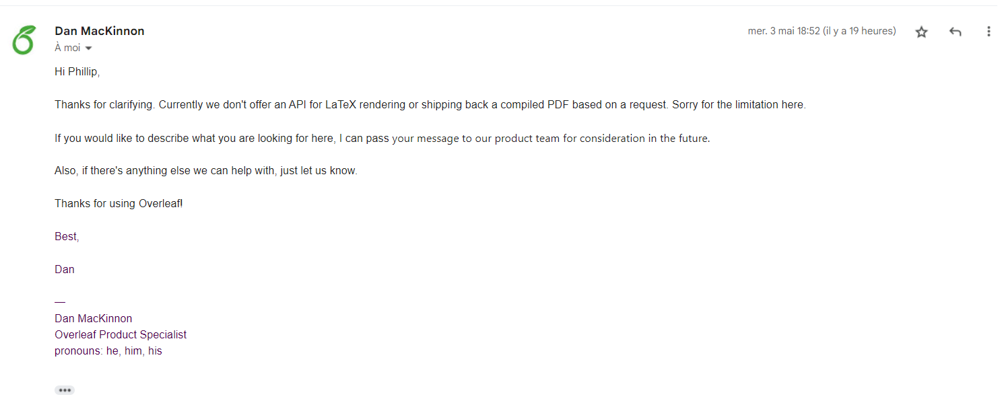

# Empty Markdown File

## Le fetch l'API "extract5.php" retourne une erreur de CORS (Cross-Origin Resource Sharing)

Pour résoudre cette errur il faut configurer le server pour autoriser les requêtes d'origine différentes, le client ne peut résoudre cette problème.

## Fonctionnalité preview qui affiche le rendu PDF d'Overleaf

Voici le site officiel de l'API d'Overleaf : https://www.overleaf.com/devs
La méthode prévue pour implémenté cette fonctionnalité est la suivante :

- envoyer le code LaTeX à l'API d'Overleaf
- extraire le lien PDF généré
- créer un iframe et mettre le PDF

La première étape se fait avec le formulaire (cf fonctionnalité "Ouvrire avec Overleaf") par contre la deuxième étape récupérer un résultat du server d'Overleaf créer un CORS erreur avec localhost et github.io.

