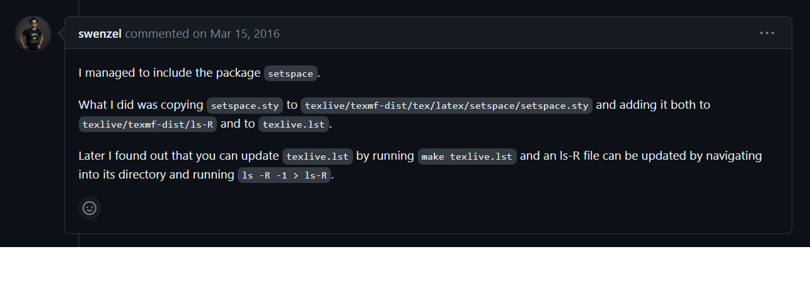
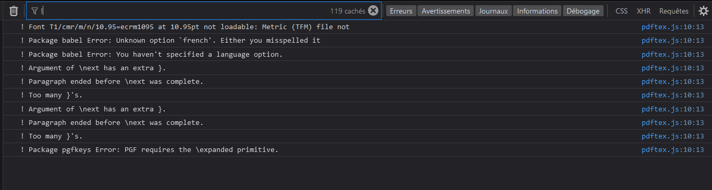

# Empty Markdown File

## Le fetch l'API "extract5.php" retourne une erreur de CORS (Cross-Origin Resource Sharing)

Pour résoudre cette errur il faut configurer le server pour autoriser les requêtes d'origine différentes, le client ne peut résoudre cette problème.

## Fonctionnalité preview qui affiche le rendu PDF d'Overleaf

Voici le site officiel de l'API d'Overleaf : https://www.overleaf.com/devs
La méthode prévue pour implémenté cette fonctionnalité est la suivante :

- envoyer le code LaTeX à l'API d'Overleaf
- extraire le lien PDF généré
- créer un iframe et mettre le PDF

La première étape se fait avec le formulaire (cf fonctionnalité "Ouvrire avec Overleaf") par contre la deuxième étape récupérer un résultat du server d'Overleaf créer un CORS erreur avec localhost et github.io.


## Fonctionnalité preview avec texlive.js

Le dossier de texlive.js se trouve dans outils_web/librairies, ce dossier est récupéré dans ce repo : https://github.com/manuels/texlive.js.

Compilation via la démo : http://manuels.github.io/texlive.js/.
Lors de la compilation de nos codes LaTeX des exercices de planche, il y'a plusieurs erreurs du au manque de package dans la version basic de texlive.js.

```javascript
 ! Package babel Error: Unknown option `french'. Either you misspelled it
(babel)                or the language definition file french.ldf was not found.
```

```javascript
! Package babel Error: You haven't specified a language option.
```

```javascript
! LaTeX Error: File `fancybox.sty' not found.
```

Après avoir importé fancybox.sty (trouver das ce site : https://ctan.org/pkg/fancybox) , il manquais encore le package tykz.sty (https://www.ctan.org/pkg/pgf) mais ce package ne s'inclus pas comme fancybox.sty car il requiert d'autre packages qui en requiert d'autres...

Voici la méthode utilisé pour inclure les packages :



Actuellement le repo de teste contient les erreurs suivants :


A noté que la compilation sur Overleaf et sur texlive.js retourne des pdf différentes en retirant

\usepackage[french]{babel}

\usepackage{fancybox}

\usepackage{tikz}
