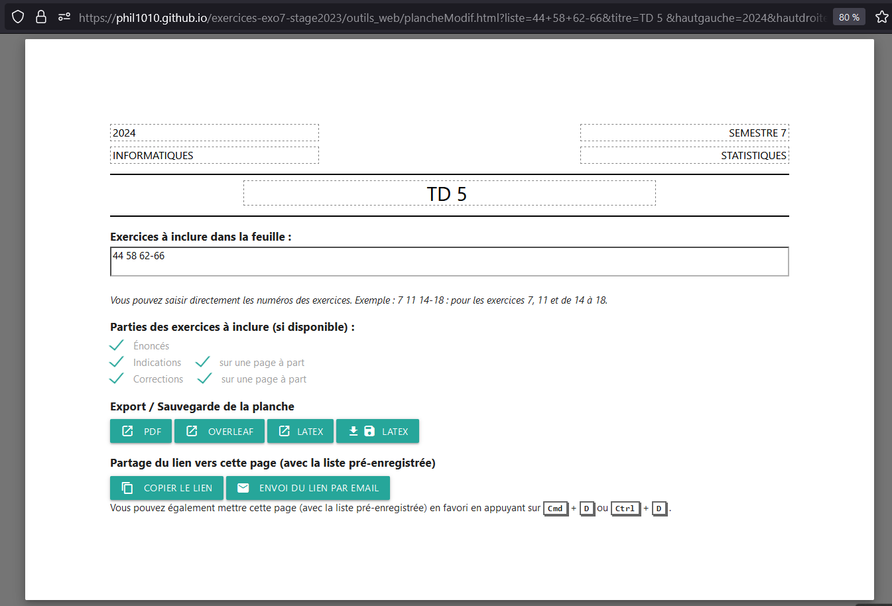
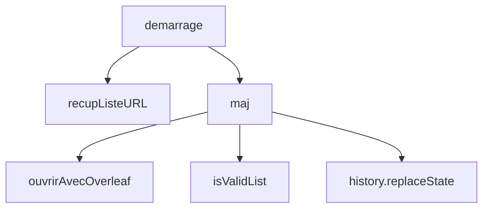
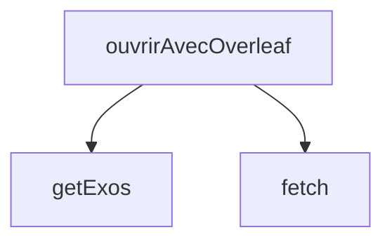
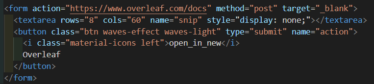
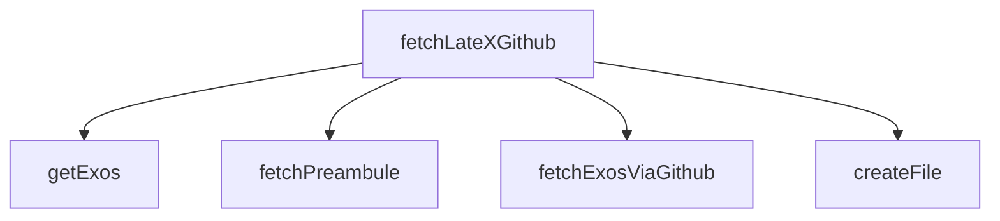
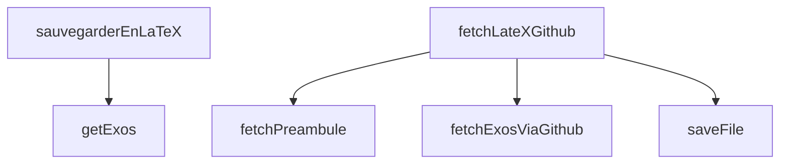

# Documentation de planche

## Explication de la page plancheModif.hml

Cette page contient les fonctionnalitées :

- Ouvrir le pfd des exos avec le bouton PDF
- Ouvrir la feuille d'exos sur overleaf
- Ouvrir le code LaTeX
- Sauvegarder le code LaTeX
- Partager le lien de la planche par mail

## Explication du fonctionnement

recupListeURl() va récupère les paramètres dans l'URL et rempli les champs du formulaire avec les valeurs de l'URL.

maj() cette fonction met à jour l'URL à chaque changement de valeur dans les paramètres. Elle prepare aussi l'ouverture avec overleaf

ouvrirAvecOverleaf() récupère les numéros des exos dans la liste des exos et fetch les codes LaTeX, les concatènes et les met dans un textArea pour utiliser l'API Overleaf. (voir doc_API_overleaf.md)

isValidList vérifie les contraintes suivantes :

- si "-" il faut que le premier chiffre soit inférieur au second, les deux soit inférieur au nombre d'exos.
- le chiffre donné est inférieur au nombre d'exos
- l'utilisateur à entré un nombre

## Fonctionnalité ouvrir le PDF

Envoie un formulaire à extract5.php avec les bons paramètres.

## Fonctionnalité ouvrir la feuille d'exos sur overleaf

Le textarea sera rempli dans la fonction ouvrirAvecOverleaf() afin que le formulaire puisse être submit au click dans la fonction maj().

## Ouvrir code LaTeX

La fonction fetchExosViaGithub retourne le code LaTeX des exos concaténé avec les options choisi par l'utilisateur, avec ou sans correction,...

## Sauvegarde code LaTeX

## Partager le lien de la planche par mail

Utilisation de mailto.

---

## Explication de planche_preview_v2.html

Cette page contient les fonctionnalités :

- Prévisualisation de la feuille d'exercices
- Sauvegarde de la planche en PDF sur le disque
- Sauvegarde du code LaTeX sur le disque
- Export de la planche en LaTeX
- Partage de la planche par mail

Elle utilise la bibliothèque texlive.js pour compiler le code LaTeX dans le navigateur (voir pour plus d'infos: http://manuels.github.io/texlive.js/)

## Prévisualisation de la feuille d'exercices

La fonction preview() va enlever les packages non reconnu par le compilateur via des regex puis compil et affiche le résultat dans un iframe.
