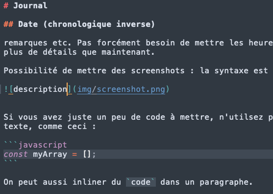

# Journal

Exemple d'utilisation : 

## Date (chronologique inverse)

remarques etc. Pas forcément besoin de mettre les heures etc, mais ça peut être bien de mettre un peu plus de détails que maintenant.

Possibilité de mettre des screenshots : la syntaxe est :




Si vous avez juste un peu de code à mettre, n'utilsez pas de screenshots, écrivez le code au format texte, comme ceci :

```javascript
const myArray = [];
```

On peut aussi inliner du `code` dans un paragraphe.

Et on peut mettre des liens, par exemple
[Syntaxe basique en markdown](https://www.markdownguide.org/basic-syntax/)


## 27 avril 
    - exercice-fetch-variable-GET et exercice-fetch-liste-GET.
    - J'ai appeler la fonction parseText() dans la fonction fetchText() au lieu de l'appeler après fetchText().
        C'était un moyen de contourner un problème (le texte fetché était de type object au lieu de string et je ne pouvais donc pas le parser). J'aimerais quand même revoir ça pour trouver une solution plus propre ça ne devrait pas être compliqué.
    - Pour la version avec la liste d'exos : le paramètre dans l'URL est une liste, je trouve que c'est plus pratique que de donner un paramètre différent pour chaque exo.


## 26 avril
    - Finition de exercice-fetch-random et exercice-fetch-liste-en-dur. Différence au niveau de l'affichage (côté html / javascript)
    - Beaucoup de bugs dans la liason entre MathJax et le fetch. (Si je fetch d'une manière, je dois reconfigurer MathJax etc)
    - Problème rencontré également avec l'utilisation d'une boucle for, j'ai donc utilisé Promise.all 
    - J'ai eu du mal avec Promise.all au début puis quand ça fonctionnait, à faire fonctionner MathJax avec.

## 25 avril


## 24 avril

    - Note : le fichier exercice-fetch-23 fetch en fait l'exercice 20 parce que j'ai oublié de changer l'URL
    - Modification du code de exercice-avec-parsage et exercice-fetch-23 en fonction des change requests dont on a parlé. (Modification de :

            la technique d'affichage dans exercice-avec-parsage (DOM).

            les remplacements de symboles speciaux / accents.

            video mieux gérée mais ce n'est probablement pas la façon dont on voudrait l'afficher.

            et autres petites modifications...)

    - J'aimerais améliorer le parsage de tout le code source et le faire d'une manière plus propre comme pour la video (Regex) mais j'attendrai votre retour sur ce que j'ai déjà implémenté d'abord.
    - Question : pour le cas de latex invalide, est-ce que je devrais imprimer le message d'erreur d'une autre façon que "document.write()" ?
    - Note to self : il y a sûrement des balises et symboles spéciaux non gérés. Par exemple dans l'exercice 2548


## 20 avril:

fetch avec parsage presque fini. 
    beaucoup de bugs quand on combine fetch et mathjax (librairie ne se charge pas au bon moment). 


## 19 avril

Refinition/correction de la première page.
    Deuxième page presque finie, parsage et affichage fonctionne.

De nouveaux bugs apparaissent souvent. Par exemple la commande latex : \qquad n'est pas  (DM : ok on en a parlé hier soir je crois, on va replace avec un code html &emsp;) interprétée dans la page web comme une commande et est affichée en texte. J'ai essayé de reconfigurer mathjax depuis un moment ou trouver une autre solution sans succès pour l'instant.

Sinon, le reste fonctionne, il restera juste à détecter le maximum de bugs éventuels (tester plusieurs exercices avec de nouveaux tags problématiques comme \qquad etc.)

## 18 avril

Finition de la premiere page et prise en main de bootstrap.
Style de page très moyen.
Debut de deuxieme page (sans fetch, avec parsage du texte). Blocage sur le problème des backslash comme discuté par mail.
Objectif pour la suite : débloquer et finir la deuxième page tout en améliorant le côté style (CSS/Bootstrap).

    (Votre solution avec String.raw`...` a débloqué le problème. Merci je ne connaissais pas cette solution.

Une fois ça fait je ferai le premier commit avec la page .io pour pouvoir visualiser.

## 17 avril

Création de la première page pour visualiser un exo (sans fetch et sans parsage tout codé en dur).
Début prise en main de Mathjax et Bootstrap.

